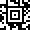
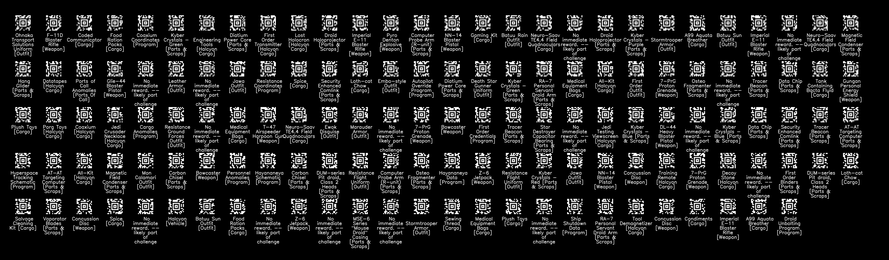

# StarwarsAztec
Random things from the Disney Star Wars trip

# Barcodes
## Individual Barcodes
Barcodes directory contains individual barcodes for each item as 40x40 Aztec codes you can scan within the disney app, 
eg: The Jawa outfit is `barcodes/116_FAL28-Jawa_Outfit_[Outfit].png`

[barcodes/116_FAL28-Jawa_Outfit_[Outfit].png](barcodes/116_FAL28-Jawa_Outfit_[Outfit].png)

## All barcodes
There is a single image of all the barcodes available too:

# Scripts
[decodeAztec.py](decodeAztec.py) - Try and decode JPGs that I had taken pictures of during the trip

[fetchCodesFromAPK.py](fetchCodesFromAPK.py) - Fetch the codes from within the decompiled APK as well as the descriptions and generate aztec codes for them

[generateAztec_two_by_two.py](generateAztec_two_by_two.py) - Generate xx_xx codes in a terminal to scan

[generateSingleImage.py](generateSingleImage.py) - Generate a single aztec code
